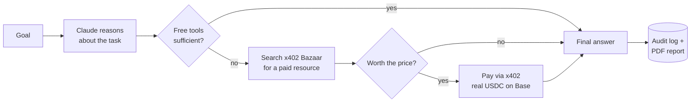

# Agentic Payments

An AI agent that autonomously decides whether a task is worth paying for — and if it is, pays for it itself, in real USDC, on the spot.

Most "AI agent + crypto payment" demos show an agent *executing* a payment it's already been told to make. This one has to *judge* that: given a goal, it has both free tools and paid ones, and has to decide - case by case - whether a paid resource is actually worth its price, or whether free data is good enough. It can go either way. Both are logged.

## How it works



Every reasoning step, tool call, and payment decision — made or blocked — is written to an audit trail and shown in a dashboard, so the agent's spending is never a black box.

## The core design principle: the LLM never touches money

The model can only call one narrow function, `fetch_paid_resource`, and that function - plain code, not the LLM - is the only thing that can move funds. It enforces a hard per-transaction and daily spending cap *before* any signature is produced, regardless of what the model decides. That cap is enforced twice over: once in this code, and independently by a Wallet Policy on the CDP wallet itself, so a bug here isn't the only thing standing between the agent and overspending.

Payments run on **x402** (Coinbase's HTTP 402-based payment protocol) against real, live pay-per-call endpoints listed in Coinbase's **x402 Bazaar** - financial data, AI inference, scraping APIs and more - paid for in USDC on Base.

## What's built

- **Agent loop** (Claude + tool use): free web search, free Bazaar search, and the one paid tool, all wired into a single reasoning loop
- **Guardrails**: per-transaction and daily USD caps, enforced in code and on the wallet itself; every decision audited
- **Dashboard**: submit a goal from the browser, watch it run, see the full reasoning/payment timeline, download the final answer as a PDF, and review every payment ever made (amount, destination, tx hash) across all runs
- **Hosted deployment**: a Render blueprint, with the dashboard gated behind a password (it can trigger real payments, so it refuses to run without one set)

A fiat-card-issuance path (USDC → virtual card → normal checkout) is scoped for later and deliberately not part of this - see [the project brief](agentic-payments-project-brief.md) for why.

## Setup

Uses a dedicated conda environment (`agentic-payments`, Python 3.11) since the system default Python (Anaconda base, 3.6) is too old for the CDP/Anthropic SDKs.

```
conda activate agentic-payments
pip install -e ".[wallet,payments,tools,ui,agent,documents,dev]"
cp .env.example .env   # then fill in real keys, including TRIGGER_API_KEY
```

Required accounts/keys: a CDP Secret API Key + Wallet Secret ([portal.cdp.coinbase.com/access/api](https://portal.cdp.coinbase.com/access/api)), an Anthropic API key, and a CDP wallet funded with a small amount of USDC on Base.

## Running it

```
# Confirm the wallet and its balance
python scripts/wallet_status.py

# Run one goal from the command line
python scripts/run_agent.py "Determine current Bitcoin market sentiment and summarize it in one paragraph."

# Or run the dashboard and submit goals from the browser
uvicorn agentic_payments.ui.app:app --reload
```

The dashboard (`/`) lists every run with total spend; `/new` submits a new goal (runs in the background, page auto-refreshes while running); each run page shows the full reasoning/tool-call/payment timeline plus a PDF download of the final answer; `/purchases` shows every payment across all runs with amount, destination, and tx hash. Every route except `/healthz` requires the `TRIGGER_API_KEY` password (HTTP Basic Auth) - the app refuses to start without it set, since it can trigger real payments.

## Deployment (Render)

`render.yaml` is a Render Blueprint: a `starter`-plan web service with a 1GB persistent disk (mounted at `/var/data`, holding the SQLite audit log and generated PDFs - the free tier has no persistent disk, so runs/spend history won't survive a restart on it). Connect the GitHub repo in the Render dashboard, and it picks up `render.yaml` automatically. Secrets (`CDP_API_KEY_ID`, `CDP_API_KEY_SECRET`, `CDP_WALLET_SECRET`, `ANTHROPIC_API_KEY`, `TRIGGER_API_KEY`) are marked `sync: false` in the blueprint, so Render prompts for them in its dashboard rather than storing them in the repo.

Render's outbound traffic comes from a shared per-region IP range rather than a single fixed address; if you deploy your own copy, add that range to your CDP key's IP allowlist (Render dashboard → your service → Connect → Outbound) or the wallet calls will fail with 401s.

## License

[MIT](LICENSE)
